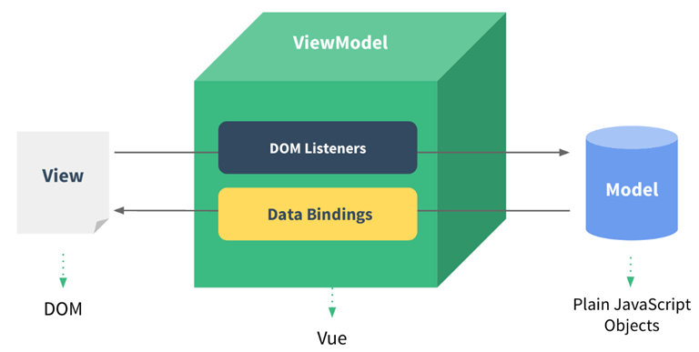
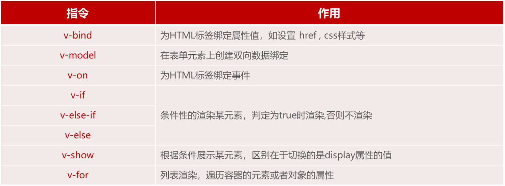
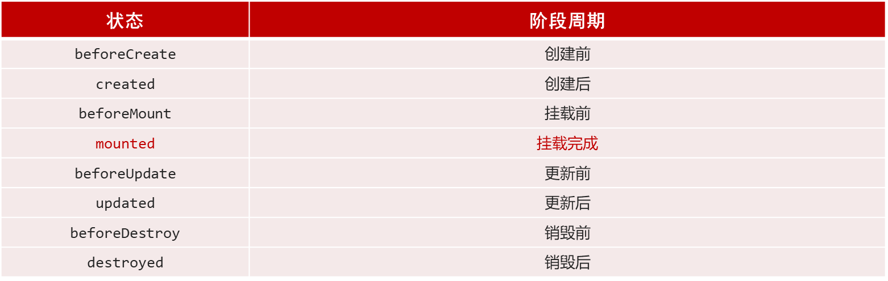
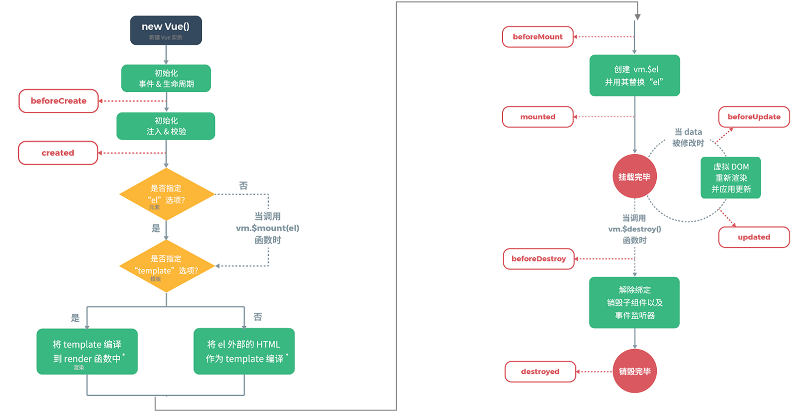

## Vue 
### 什么是Vue
1. Vue 是一套前端框架，免除原生 JavaScript 中的 DOM 操作，简化书写。--> 框架就是简化的软件
2. 基于 **MVVM**(Model-View-ViewModel) 思想，实现数据的*双向绑定*，将编程的关注点放在数据上。》》》双向，一旦View 或者 Model 发生改变，另一方也会对应改变
3. 官网： https://v2.cn.vuejs.org/
4. 框架：是一个半成品软件，是一套可重用的、通用的、软件基础代码模型。基于框架进行开发，更加快捷、更加高效。

### vue 快速入门
1. 新建HTML页面，引入Vue.js文件（vue 官方提供）
    ```javascript
    <script src="js/vue.js"></script>
    ```
2. 在JS代码区域，创建Vue核心对象，定义数据模型 --》》 这个创建的 Vue 对象接管的是视图中的 div 区域
    ```javascript
    <script>
        new Vue({
            el: "#app",  // 》》》  <-- 开头，表示id选择器， 因此需要在视图中设定一个id=app >
            data: {
                message: "Hello Vue!"
            }
        })
    </script>
    ```
3. 编写视图
    ```javascript
    <div id="app">
    <input type="text" v-model="message"> // v-model 表示数据模型
        {{ message }}
    </div>
    ```
4. 插值表达式
    - 形式：{{ 表达式 }}。
    - 内容可以是： 变量、三元运算符、函数调用、算术运算
### Vue常用指令
1. *指令*：HTML 标签上带有 v- 前缀 的特殊属性，不同指令具有不同含义。例如：v-if，v-for…
2. 常用指令
    
#### v-bind、v-model
```javascript
<script>
  new Vue({
     el: "#app",
     data: {
        url: "https://www.itcast.cn"  // 这个URL是我们定义的数据模型！
     }
  })
</script>
```
- v-bind
    ```javascript
    <a v-bind:href="url">传智教育</a>   // 方式一， 将数据模型绑定
    <a :href="url">传智教育</a> // 方式二，省略
    ```
- v-model
    ```javascript
    <input type="text" v-model="url">
    ```
- 通过v-bind或者v-model绑定的变量，必须在数据模型中声明。

#### v-on
```javascript
<input type="button" value="按钮" v-on:click="handle()"> // 方式一
<input type="button" value="按钮" @click="handle()"> // 方式二， 省略 v-on

<script>
	new Vue({
		el: "#app",
		data: {
			//...
		},
		methods: {  // 与 data 平级
			handle:function(){
				alert('我被点击了');
			}
		},
	})
</script>
```
#### v-if、v-show
- v - if
    ```html
    年龄{{age}},经判定为:  // 三个 span 中，只有条件成立的会被浏览器渲染， 不成立则不渲染
    <span v-if="age <= 35">年轻人</span>
    <span v-else-if="age > 35 && age < 60">中年人</span>
    <span v-else>老年人</span>
    ```
- v - show： 都被渲染，只是不满足条件则不展示， 是通过 css 的display控制
    ```html
    年龄{{age}},经判定为:
    <span v-show="age <= 35">年轻人</span>
    ```
#### v - for
```html
<div v-for="addr in addrs">{{addr}}</div>
<div v-for="(addr,index) in addrs">{{index + 1}} : {{addr}}</div>

data: {
   . . .
   addrs: ['北京','上海','广州','深圳','成都','杭州']
},
```
#### 案例
```html
<body>
    <div id="app">   
        <table border="1" cellspacing="0" width="60%">
            <tr>
                <th>编号</th>
                <th>姓名</th>
                <th>年龄</th>
                <th>性别</th>
                <th>成绩</th>
                <th>等级</th>
            </tr>
            // 数据循环展示
            <tr align="center" v-for="(user, index) in users">
                <td>{{index + 1}}</td>
                <td>{{user.name}}</td>
                <td>{{user.age}}</td>
                <td>
                    <span v-if="user.gender == 1">男</span>
                    <span v-if="user.gender == 2">女</span>
                </td>
                <td>{{user.score}}</td>
                <td>
                    <span v-if="user.score >= 85">优秀</span>
                    <span v-else-if="user.score >=60">及格</span>
                    <span style="color: red;" v-else>不及格</span>
                </td>
            </tr>
        </table>
    </div>
</body>

<script>
    new Vue({
        el: "#app",
        data: {
            users: [{
                name: "Tom",
                age: 20,
                gender: 1,
                score: 78
            },{
                name: "Rose",
                age: 18,
                gender: 2,
                score: 86
            },{
                name: "Jerry",
                age: 26,
                gender: 1,
                score: 90
            },{
                name: "Tony",
                age: 30,
                gender: 1,
                score: 52
            }]
        },
        methods: {
            
        },
    })
```
### vue 生命周期
- 生命周期：指一个对象从*创建到销毁*的整个过程。
- 生命周期的***八***个阶段：每触发一个生命周期事件，会自动执行一个生命周期方法(钩子方法)。





- mounted：挂载完成，Vue初始化成功，HTML页面渲染成功。（发送请求到服务端，加载数据）
	- 在生命周期中自动调用
    ```javascript
    <script>
        new Vue({
            el: "#app",
            data: {
                
            },
            mounted() {  // 钩子方法，在这里发送请求到服务端，来获取数据
                console.log("Vue挂载完毕,发送请求获取数据");
            },
            methods: {
               
            },
        })
    </script>

    ```
![[Pasted image 20241226142834.png]]
