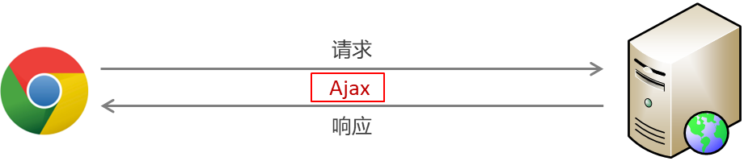
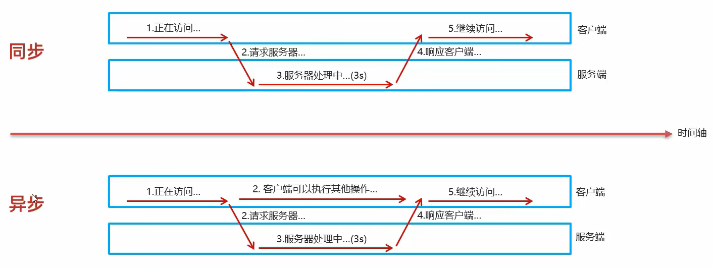
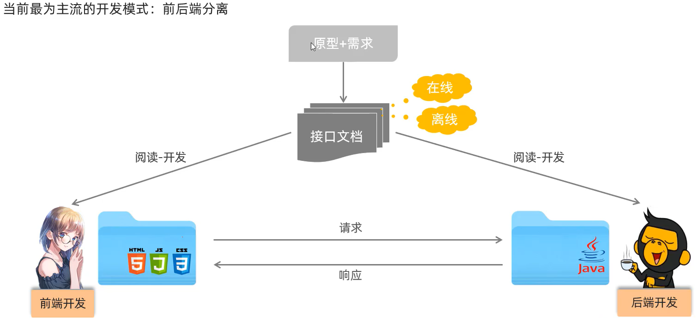
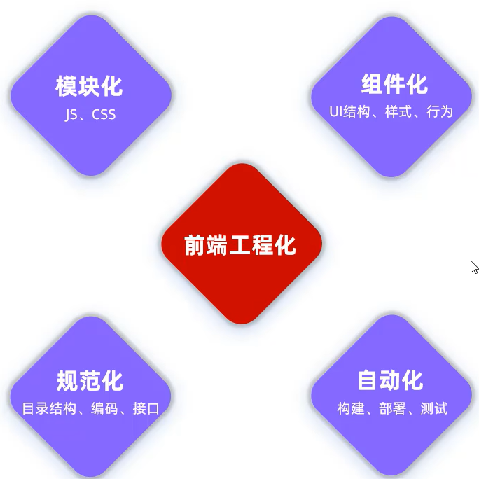
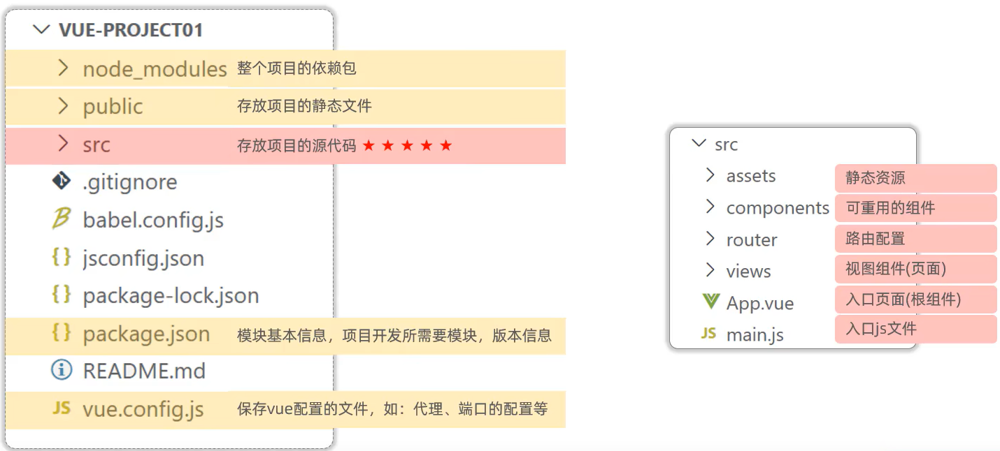
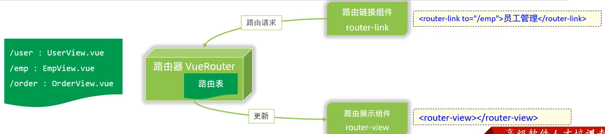
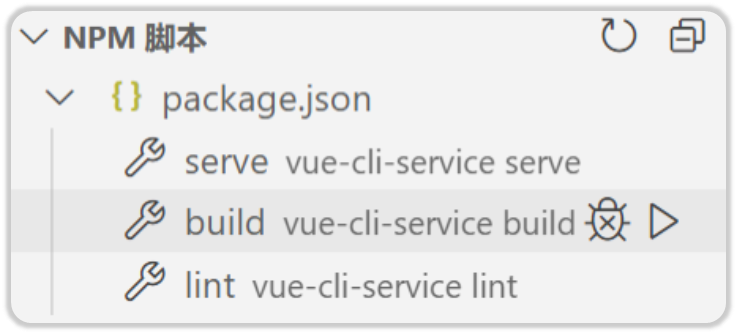
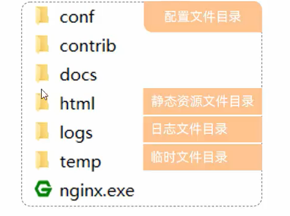

## Ajax、Vue - Element
### Ajax
1. 概念： Asynchronous JavaScript And XML，异步的JavaScript和XML。(xml用于存储数据)
2. 作用：
    - 数据交换：通过 Ajax 可以给服务器发送请求，并获取服务器响应的数据。 
    

    - *异步交互：*
	    - 可以在*不重新加载*整个页面的情况下，与服务器交换数据并更新部分网页的技术，如：搜索联想、用户名是否可用的校验等等。
1. 同步和异步
    
同步请求：客户端发送请求，并等待服务器响应，此时客户端没有反应

#### 原生 Ajax请求
- 创建XMLHttpRequest对象：用于和服务器交换数据
- 向服务器发送请求
- 获取服务器响应数据

![[Pasted image 20241226161226.png]]
--> 技术太旧，没人用了

#### Axios
- 介绍：Axios 对原生的Ajax进行了封装，简化书写，快速开发。
- 官网： https://www.axios-http.cn/

1. Axios 入门
    - 1. 引入Axios的js文件
    ```javascript
    <script src="js/axios-0.18.0.js"></script>
    ```
    - 2. 使用Axios发送请求，并获取响应结果
    ```javascript
    axios({
        method: "get", // get请求的参数添加到url后面，用问号表示
        url: "http://yapi.smart-xwork.cn/mock/169327/emp/list"
    }).then((result) => {
        console.log(result.data);
    });  // 小括号内是 js 对象，用大括号包起来

    axios({
        method: "post",
        url: "http://yapi.smart-xwork.cn/mock/169327/emp/deleteById",
        data: "id=1"  // 使用data属性来传递 post 的请求参数
    }).then((result) => {  // 使用 then 函数获取服务器发送回来的数据
        console.log(result.data);  // result也是 js 对象
    });
    ```
![[Pasted image 20241226162957.png]]


1. 请求别名
    - axios.get(url [, config])
    - axios.delete(url [, config])
    - axios.post(url [, data[, config]])
    - axios.put(url [, data[, config]])
    ```javascript
    // 发送 GET 请求
    axios.get("http://yapi.smart-xwork.cn/mock/169327/emp/list").then((result) => {
        console.log(result.data);
    });

    // 发送 POST 请求
    axios.post("http://yapi.smart-xwork.cn/mock/169327/emp/deleteById","id=1").then((result) => {
        console.log(result.data);
    });

---
<script>
    function get(){
        //通过axios发送异步请求-get
         axios({
             method: "get",
             url: "http://yapi.smart-xwork.cn/mock/169327/emp/list"
         }).then(result => {
             console.log(result.data);
         })


        axios.get("http://yapi.smart-xwork.cn/mock/169327/emp/list").then(result => {
            console.log(result.data);
        })
    }

    function post(){
        //通过axios发送异步请求-post
        // axios({
        //     method: "post",
        //     url: "http://yapi.smart-xwork.cn/mock/169327/emp/deleteById",
        //     data: "id=1"
        // }).then(result => {
        //     console.log(result.data);
        // })

        axios.post("http://yapi.smart-xwork.cn/mock/169327/emp/deleteById","id=1").then(result => {
            console.log(result.data);
        })
    }
</script>

    ```

##### Axios 案例
```html
<!DOCTYPE html>
<html lang="en">
<head>
    <meta charset="UTF-8">
    <meta http-equiv="X-UA-Compatible" content="IE=edge">
    <meta name="viewport" content="width=device-width, initial-scale=1.0">
    <title>Ajax-Axios-案例</title>
    <script src="js/axios-0.18.0.js"></script>
    <script src="js/vue.js"></script>
</head>
<body>
    <div id="app">
        <table border="1" cellspacing="0" width="60%">
            <tr>
                <th>编号</th>
                <th>姓名</th>
                <th>图像</th>
                <th>性别</th>
                <th>职位</th>
                <th>入职日期</th>
                <th>最后操作时间</th>
            </tr>

            <tr align="center" v-for="(emp,index) in emps">
                <td>{{index + 1}}</td>
                <td>{{emp.name}}</td>
                <td>
                    
                </td>
                <td>
                    <span v-if="emp.gender == 1">男</span>
                    <span v-if="emp.gender == 2">女</span>
                </td>
                <td>{{emp.job}}</td>
                <td>{{emp.entrydate}}</td>
                <td>{{emp.updatetime}}</td>
            </tr>
        </table>
    </div>
</body>
<script>
    new Vue({
       el: "#app",
       data: {
         emps:[]
       },
       mounted () { // 页面加载完成后，进行挂载
          //发送异步请求,加载数据
          axios.get("http://yapi.smart-xwork.cn/mock/169327/emp/list").then(result => {
            // <!-- 将返回的数据赋值给emps，this代表当前Vue实例 -->
            this.emps = result.data.data; 
          })
       }
    });
</script>
</html>
```


### 前后端分离开发
				前后端代码不在同一个项目中
将整个软件项目分为两个部分：



这里的接口指的是业务功能，而不是interface.产品经理提供 
示例：[[out/production/javaweb/day03-Vue-Element/资料/接口文档示例/接口文档-示例|接口文档-示例]]
#### YAPI - 接口文档管理平台
- 介绍：YApi 是高效、易用、功能强大的 api 管理平台，旨在为开发、产品、测试人员提供更优雅的接口管理服务
- 地址： http://yapi.smart-xwork.cn/
- API接口管理、Mock服务
- 使用mock模拟，这样前后端可以同时开发：
![[Pasted image 20241226165317.png]]

### 前端工程化




前端工程化：是指在企业级的前端项目开发中，把前端开发所需的工具、技术、流程、经验等进行规范化、标准化。
#### vue - cli
1. 介绍： Vue-cli 是Vue官方提供的一个*脚手架*，用于快速生成一个 Vue 的项目模板。
2. Vue-cli提供了如下功能：
    - 统一的目录结构
    - 本地调试方便
    - 热部署
    - 单元测试
    - 集成打包上线
3. *依赖环境：NodeJS* 

#### Vue项目-创建
1. 命令行： `npm install -g @vue/cli`, `vue create vue-project01`
2. 图形化界面： `vue ui`
3. 基于Vue脚手架创建出来的工程，有标准的*目录结构，*如下：
    
4. Vue 项目 启动
    - 方式一：vs code 图形化界面
    - 方式二：命令行 `npm run serve`
(如果提示 npm 命令不可用则重启代码编辑器，以便编辑器能够识别到新加入的命令)

以下页面是 App.vue 文件渲染出的
![[Pasted image 20241226203656.png]]

修改 App 的内容，浏览器会实时渲染页面（--> Vue项目的热部署功能）：
```html
<template>
  <div id="app">  // 这个 id 是用来控制 css 样式的，见 style 中的 #app
    <nav>
      <router-link to="/">Vue Home</router-link> |
      <router-link to="/about">About</router-link>
    </nav>
    <router-view/>
  </div>
</template>

<style>
#app {
  font-family: Avenir, Helvetica, Arial, sans-serif;
  -webkit-font-smoothing: antialiased;
  -moz-osx-font-smoothing: grayscale;
  text-align: center;
  color: #2c3e50;
}

nav {
  padding: 30px;
}

nav a {
  font-weight: bold;
  color: #2c3e50;
}

nav a.router-link-exact-active {
  color: #42b983;
}
</style>

```


1. ***配置端口***，避免和Tomcat的默认端口冲突：
    ```javascript
    const { defineConfig } = require('@vue/cli-service')
    module.exports = defineConfig({
      transpileDependencies: true,
      
      devServer: {
        port: 7000,
        
      }
    })
    ```

默认端口修改成功：
![[Pasted image 20241226204426.png]]

#### Vue项目开发流程
![[Pasted image 20241226205112.png]]


- Vue的组件文件以 .vue结尾，每个组件由三个部分组成：`<template> 、<script>、<style> `。
	- `<template>` : 模板部分，由它生成*HTML*代码
	- `<script>` : 控制模板的数据来源和行为。如果模板中调用了一个函数，那么需要在script部分定义这一个函数
	- `<style>` : css样式部分

![[Pasted image 20241226205622.png]]


以下是修改后的 App.vue :
```html
<template>
  <div>
    <h1>{{ message }}</h1>
  </div>
</template>

<script>
export default{  // 使用export将我们定义的对象导出去，方便其他地方引用
  data() {
    return {
      // 定义data数据，用于存储页面数据
      message: "Hallo Vue"
    }
  },

  methods:{

  }
}
</script>


<style>

</style>

```
### Vue 组件库 Element
#### 什么是 Element
- Element ：是饿了么团队研发的，一套为开发者、设计师和产品经理准备的基于 Vue 2.0 的桌面端组件库。
- 组件：组成网页的部件，例如 超链接、按钮、图片、表格、表单、分页条等等。
- 后端程序员也能制作好看的页面
- 官网： https://element.eleme.cn/#/zh-CNListener
![[Pasted image 20241226210931.png]]

#### 快速入门
1. 安装ElementUI组件库 （*在当前工程的目录下*），在命令行执行指令： `npm install element-ui@2.15.3 `, 会存放在 `node_modules` 目录下
2. *在入口文件 **main.js** 中*引入ElementUI组件库
    ```javascript
    import ElementUI from 'element-ui';
    import 'element-ui/lib/theme-chalk/index.css';
    
    Vue.use(ElementUI);
    ```
3. 定义i组件文件，访问官网，复制组件代码，调整 
- 不要改动根组件（App），而是重新创建 views 目录下的文件 element
- 注意，**文件名采用驼峰命名**
![[Pasted image 20241226211547.png]]


在根组件App中展示 ElementView组件，需要在 template 标签中添加我们创建的ElementView组件：
```html
// App.vue
<template>
  <div>
    <!-- <h1>{{ message }}</h1> -->
    <element-view></element-view>
  </div>
</template>

<script>
import ElementView from './views/element/ElementView.vue';

export default{  // 使用export将我们定义的对象导出去，方便其他地方引用
  // ! 这里的components属性是用来注册组件的，这里我们注册了ElementView组件
  components: {ElementView},

  data() {
    return {

      message: "Hallo Vue"
    }
  },

  methods:{

  }
}
</script>
```


#### 常见组件
1. Table 表格：用于展示多条结构类似的数据，可对数据进行排序、筛选、对比或其他自定义操作。注意可以使用多种风格的表格
2. Pagination 分页：当数据量过多时，使用分页分解数据。不同风格的分页条也可以在elements上找
	- ![[Pasted image 20241227121256.png]]
	- 我们可以在layout中控制分页条展示的具体信息
	- layout属性的顺序就是显示的顺序
1. Dialog 对话框：在保留当前页面状态的情况下，告知用户并承载相关操作。用户可以输入信息
2. Form 表单：由输入框、选择器、单选框、多选框等控件组成，用以收集、校验、提交数据。
3. Vue项目中使用Axios:
    - 在项目目录下安装axios：npm  install axios;
    - 需要使用axios时，导入axios：import axios from 'axios';

#### 案例
![[Pasted image 20241227123403.png]]
`D:\javaweb\src\day03-Vue-Element\资料\页面原型\tlias智能学习辅助系统`
目标：将json格式的数据动态渲染，展示在网页上

步骤：
1. 创建页面，完成页面的整体布局规划
2. 布局中各个部分的组件实现
3. 列表数据的异步加载，并渲染展示

快速布局。使用容器：
![[Pasted image 20241227125426.png]]

1 和 2：
```html
<template>
    <div>
        <el-container style="height: 700px; border: 1px solid #eee">
            <!-- 顶部导航栏 -->
            <el-header style="font-size: 40px; background-color: rgb(238, 241, 246)">tlias 智能学习辅助系统</el-header>  
            <el-container>
                <!-- 侧边栏 -->
                <el-aside width="200px">


                    <el-menu :default-openeds="['1', '3']">
                        <el-submenu index="1">
                            <template slot="title"><i class="el-icon-message"></i>系统信息管理</template>
                           
                            <el-menu-item index="1-1">部门管理</el-menu-item>
                            <el-menu-item index="1-2">员工管理</el-menu-item>
                           
                            
                        </el-submenu>
                        
                        </el-menu>
                </el-aside>

                <!-- 主体内容 -->
                <el-main>
                    <!-- 表单 -->
                    <el-form :inline="true" :model="searchForm" class="demo-form-inline">
                        <el-form-item label="姓名">
                            <el-input v-model="searchForm.name" placeholder="姓名"></el-input>
                        </el-form-item>
                        <el-form-item label="性别">
                            <el-select v-model="searchForm.gender" placeholder="性别">
                            <el-option label="男" value="1"></el-option>
                            <el-option label="女" value="2"></el-option>
                            </el-select>
                        </el-form-item>
                        <!-- 添加入职日期 -->
                         <el-form-item label="入职日期">
                            <el-date-picker
                                v-model="searchForm.entrydate"
                                type="daterange"
                                range-separator="To"
                                start-placeholder="Start date"
                                end-placeholder="End date">
                                </el-date-picker>
                            </el-form-item>
                        <el-form-item>
                            <el-button type="primary" @click="onSubmit">查询</el-button>
                        </el-form-item>
                    </el-form>

                    <!-- 表格 -->
                    <el-table :data="tableData" boder>
                        <el-table-column prop="name" label="姓名" width="180"></el-table-column>
                        <el-table-column prop="image" label="图像" width="180"></el-table-column>
                        <el-table-column prop="gender" label="性别" width="140"></el-table-column>
                        <el-table-column prop="job" label="职位" width="140"></el-table-column>
                        <el-table-column prop="entrydate" label="入职日期" width="180"></el-table-column>
                        <el-table-column prop="updatetime" label="最后操作时间" width="230"></el-table-column>
                        <el-table-column label="操作" >
                            <el-button type="primary" size="mini">编辑</el-button>
                            <el-button type="danger" size="mini">删除</el-button>
                        </el-table-column>
                    </el-table>
                    <br><br>
                    <!-- 分页 -->
                    <el-pagination background layout="total, sizes, prev, pager, next, jumper"
                        @size-change="handleSizeChange"
                        @current-change="handleCurrentChange"
                        :total="1000">
                    </el-pagination>
                </el-main>
            </el-container>
        </el-container>

    </div>


</template>

<script>
    export default {
        data(){
            return {
                tableData: [],
                searchForm: {
                    name: "",
                    gender: "",
                    entrydate: []
                }
            }
        },
        methods : {
            onSubmit: function(){
                alert("查询成功");
            },
            handleSizeChange: function(val){
                alert("每页记录数变化" + val)
            },
            handleCurrentChange: function(val){
                alert("当前页变化" + val)
            }
        }
    }
</script>
```

3 需要使用 axios 实现异步加载列表数据：
- 在项目目录下安装 axios  ： `npm inistall axios`, 安装完成后重启项目
- 需要使用 axios 时，导入：`import axios from 'axios';`


### Vue 路由
前端路由: URL中的hash(#号后面的部分) 与组件之间的对应关系。

![[Pasted image 20241227153602.png]]

#### Vue Router
1. 介绍： `Vue Router` 是 Vue 的官方路由。
2. 组成：
    - `VueRouter`：路由器类，根据路由请求在路由视图中动态渲染选中的组件
    - `<router-link>`： 请求链接组件，浏览器会解析成   `<a>`
    - `<router-view>`：动态视图组件，用来渲染展示与路由路径对应的组件
    
注意组件和路由标识之间的对应关系

1. 安装(创建Vue项目时已选择) `npm install vue-router@3.5.1 `
    ```javascript
    <el-menu-item index="1-1">
                                <router-link to="/dept">部门管理</router-link>
                                
                            </el-menu-item>
                            <el-menu-item index="1-2">员工管理</el-menu-item>
    
    
    // 在根组件中添加以下内容并删除之前导入的固定路由 
    <router-view></router-view>
    ```
1. 定义路由
`router/index.js`

```javascript
import Vue from 'vue'
import VueRouter from 'vue-router'

Vue.use(VueRouter)

const routes = [
  {
    path: '/emp',
    name: 'emp',
    component: () => import('../views/tlias/EmpView.vue')
  },
  {
    path: '/dept',
    name: 'dept',
    component: () => import(/* webpackChunkName: "about" */ '../views/AboutView.vue')
  },
  
    {
      path: '/about',
      name: 'about',
      component: () => import(/* webpackChunkName: "about" */ '../views/AboutView.vue')
    }
  
]
```
![[Pasted image 20241227154746.png]]

*解决默认进入根目录的问题*：
因为我们没有定义根路由的界面，而程序启动后默认进入根路由，因此需要重定向：
![[Pasted image 20241227155335.png]]


### 打包 - 部署
前后端程序需要分别部署在不同的服务器上。前端工程 通常部署在 Nginx上
#### 打包
![[Pasted image 20241227155520.png]]

#### 部署
![[Pasted image 20241227155944.png]]
- 介绍：Nginx是一款轻量级的Web服务器/反向代理服务器及电子邮件（IMAP/POP3）代理服务器。其特点是占有内存少，*并发能力强*，在各大型互联网公司都有非常广泛的使用。
- nginx 功能十分强大，我们在案例中只是用其中的很小一部分功能
- 官网：https://nginx.org/
- 部署：将打包好的 `dist` 目录下的文件，复制到*nginx*安装目录的html目录下 `E:\nginx-1.22.0\html`
- 启动：双击 nginx.exe 文件即可，Nginx服务器默认占用 80 端口号
```

<div align=center></div>
```

- Nginx默认占用80端口号，如果80端口号被占用，可以在nginx.conf中修改端口号。(`netstat –ano | findStr  80`)
- 访问： 浏览器地址栏输入 `localhost:80/...`