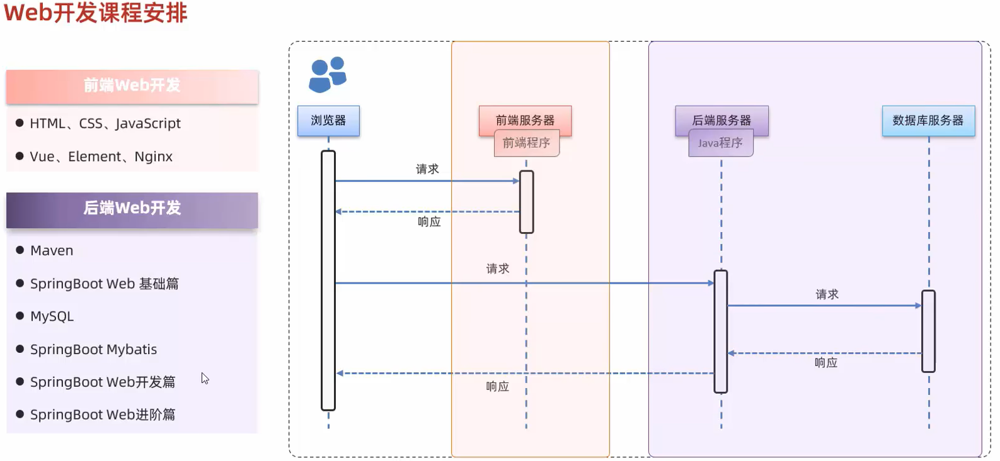
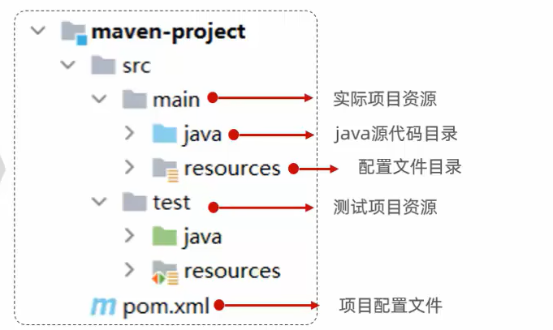
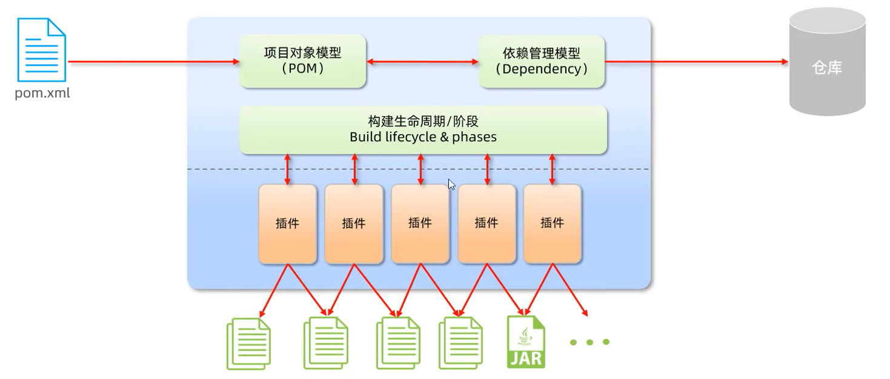
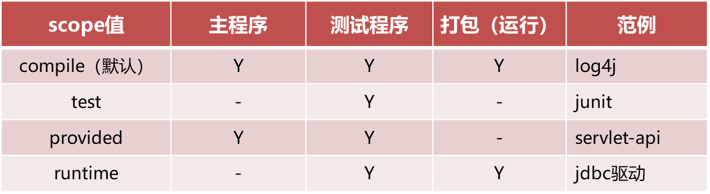
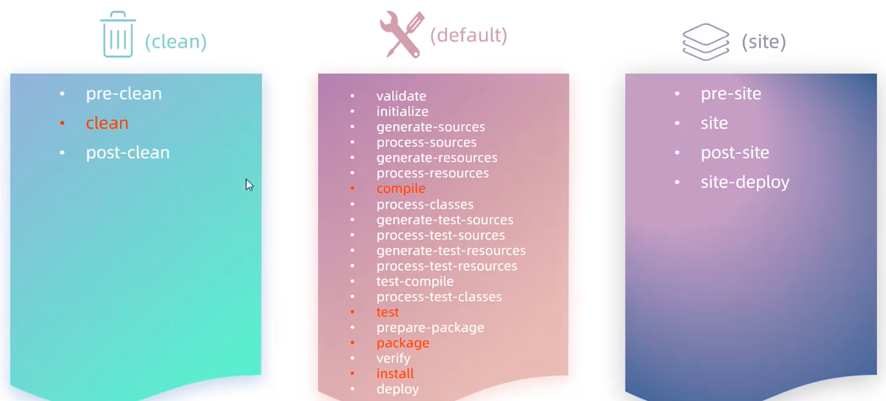
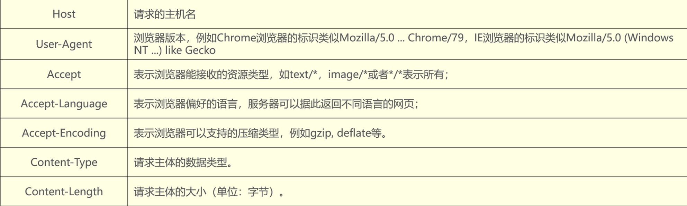
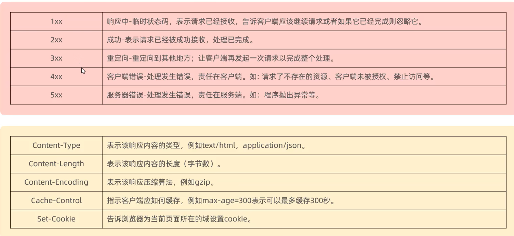

# Web 后端开发

## Maven
Maven是apache旗下的一个开源项目，是一款用于管理和*构建*java项目的工具。
### Maven 作用  
1. 依赖管理： 方便快捷的管理项目依赖的资源(jar包)，避免版本冲突问题（类似conda）
	- 一个大项目可能涉及很多jar包，单个导入费时费力，而且不同版本的jar包会产生冲突

2. 统一项目结构： 提供标准、统一的项目结构
    （不同开发工具的目录结构不同）
    
1. 标准化的项目*构建流程*： 标准跨平台（Linux、Windows、MacOS）的自动化项目构建方式。 清理 -> 编译 -> 测试 -> 打包 -> 发布
### 概述
1. Apache Maven 是一个项目管理和构建工具，它基于*项目对象模型* (*POM*, project object model) 的概念，通过一小段描述信息来管理项目的构建。
2. 作用： 
    - 方便的依赖管理
    - 统一的项目结构
    - 标准的项目构建流程
3. 官网：`http://maven.apache.org/`
    
4. 仓库：用于存储资源，管理各种 jar 包。
    - *本地仓库*：自己计算机上的一个目录。
    - 中央仓库：由 Maven 团队维护的*全球唯一*的, 包含全世界所有公开的jar包。 仓库地址：https://repo1.maven.org/maven2/
    - *远程仓库*(私服)：一般由公司团队搭建的私有仓库。
![[Pasted image 20241227162810.png]]

#### 安装
1. 解压 apache-maven-3.6.1-bin.zip 。
2. 配置本地仓库：修改 conf/settings.xml 中的 `<localRepository>` 为一个指定目录。
    ```xml
    <localRepository>E:\develop\apache-maven-3.6.1\mvn_repo</localRepository>
    ```
3. 配置阿里云私服：修改 conf/settings.xml 中的 `<mirrors>` 标签，为其添加如下子标签：

    ```xml
    <mirror>  
    <id>alimaven</id>  
    <name>aliyun maven</name>  
    <url>http://maven.aliyun.com/nexus/content/groups/public/</url>
    <mirrorOf>central</mirrorOf>          
    </mirror>
    ```
4. 配置环境变量: MAVEN_HOME 为 maven 的解压目录，并将其 bin 目录加入 PATH 环境变量。
5. 测试 mvn -v
### IDEA 集成 Maven
#### Maven 坐标
1. 什么是坐标？
    - Maven 中的坐标是*资源的唯一标识*，通过该坐标可以唯一定位资源位置。
    - 使用坐标来定义项目或引入项目中需要的依赖。
2. Maven 坐标主要组成
    - groupId：定义当前Maven项目隶属组织名称（通常是*域名反写*，例如：com.itheima）
    - artifactId：定义当前Maven项目名称（通常是模块名称，例如 order-service、goods-service）
    - version：定义当前项目版本号

    ```xml
    <groupId>com.itheima</groupId>
    <artifactId>maven-project01</artifactId>
    <version>1.0-SNAPSHOT</version>

    <dependency>   <groupId>ch.qos.logback</groupId>  <artifactId>logback-classic</artifactId>  <version>1.2.3</version></dependency>
    ```

#### 配置MAVEN环境
![[Pasted image 20241227165326.png]]


##### 创建模块
![[Pasted image 20241227170904.png]]

新版本 idea 使用 quickstart

##### 导入Maven 项目
![[Pasted image 20241227200853.png]]

![[Pasted image 20241227201748.png]]


### 依赖管理
#### 依赖配置

1. 依赖：指当前项目运行所需要的 *jar* 包，一个项目中可以引入多个依赖。
2. 配置：
    - 在 pom.xml 中编写 `<dependencies>` 标签
    - 在 `<dependencies> 标签中 使用 ` `<dependency>` 引入坐标
      - 定义坐标的 groupId，artifactId，version
       - 点击*刷新*按钮，引入最新加入的坐标 
    
```xml
<dependencies>
<dependency>        
	<groupId>ch.qos.logback</groupId>   // 第二步 组织id
	<artifactId>logback-classic</artifactId>     // 第一步：资源名   
	<version>1.2.3</version>  
</dependency>
</dependencies>
```
    
1. 如果引入的依赖，在本地仓库不存在，将会连接远程仓库/中央仓库，然后下载依赖。（这个过程会比较耗时，耐心等待）
2. 如果*不知道依赖的坐标信息*，可以到 https://mvnrepository.com/ 中搜索。还可以查看某个版本的使用次数


####  依赖传递
![[Pasted image 20241227202939.png]]
1. 依赖具有传递性
    - 直接依赖：在当前项目中通过依赖配置建立的依赖关系
    - 间接依赖：被依赖的资源如果依赖其他资源，当前项目间接依赖其他资源
2. 排除依赖
    - 排除依赖指主动断开依赖的资源，被排除的资源无需指定版本。


    ```xml
    <dependency>  
     <groupId>com.itheima</groupId> 
     <artifactId>maven-projectB</artifactId> 
     <version>1.0-SNAPSHOT</version>     
     <exclusions>       
      <exclusion>        
       <groupId>junit</groupId>           
       <artifactId>junit</artifactId>    
       </exclusion>    
     </exclusions>
    </dependency>
    ```

#### 排除依赖
![[Pasted image 20241227204433.png]]
如果A依赖了B，B依赖C，那么A中也会有jar包，但是我们在项目A中不需要这个jar

exclusions可以包含多个依赖

#### 依赖范围
1. 依赖的jar包，*默认*情况下，可以在任何地方使用。可以通过 `<scope>…</ scope >` 设置其作用范围。
2. 作用范围：
    - 主程序范围有效。（main文件夹范围内）
    - 测试程序范围有效。（test文件夹范围内）
    - 是否参与打包运行。（package指令范围内）
    ```xml
    <dependency>
        <groupId>junit</groupId>
        <artifactId>junit</artifactId>
        <version>4.10</version>
        <scope>test</scope > // 控制范围
    </dependency>
    ```
    
#### 生命周期
1. Maven的生命周期就是为了对所有的maven项目构建过程进行抽象和统一。
2. Maven中有*3套*相互独立的生命周期：
    - clean：清理工作，清理上一次项目构建产生的文件，例如class文件和jar文件。
    - default：核心工作，如：编译、测试、打包、安装、部署等。
    - site：生成报告、发布站点等，很少用。
3. 每套生命周期包含一些阶段（phase），阶段是有顺序的，后面的阶段依赖于前面的阶段。
    
4. 使用maven 生命周期阶段
    - clean：移除上一次构建生成的文件
    - compile：编译项目源代码, 字节码文件出现在`target`目录中
    - test：使用合适的单元测试框架运行测试(junit)
    - package：将编译后的文件打包，如：jar、war等
    - install：安装项目到本地仓库
    - ![[Pasted image 20241227205957.png]]
1. 在***同一套***生命周期中，*当运行后面的阶段时，前面的阶段都会运行*。
2. 执行指定生命周期的两种方式：
    - 在idea中，右侧的maven工具栏，选中对应的生命周期，双击执行。
    - 在命令行中，通过命令执行。
	    - `mvn clean`
		- `mvn compile`
		- `mvn package`
		- `mvn test`


## SpringBootWeb 入门
### Spring
1. 官网：`spring.io`
2. Spring发展到今天已经形成了一种开发生态圈，Spring提供了若干个子项目，每个项目用于完成特定的功能。

3. Spring Framework 配置繁琐、入门难度大； Spring Boot 简化配置、快速开发
4. Spring Boot 可以帮助我们非常快速的构建应用程序、简化开发、提高效率 。
5. cloud创建微服务，将大块业务分割成小的
### SpringBootWeb入门
例子： 创建 SpringBoot 项目
![[Pasted image 20241227211614.png]]

1. 创建 springboot 模块，并勾选web开发相关的依赖 》》 注意不是maven，而是spring，需要专业版
2. 定义 HelloController 类，添加方法 hello 并添加注解
3. 运行测试

![[Pasted image 20241227213423.png]]

### HTTP协议
#### HTTP-概述
1. 概念：Hyper Text Transfer Protocol，超文本传输协议，规定了浏览器和服务器之间数据传输的规则。
2. 特点：
    - 基于TCP协议：面向连接，安全
    - 基于请求-响应模型的：一次请求对应一次响应
    - HTTP协议是无状态的协议：对于事务处理没有记忆能力。每次请求 - 响应都是独立的。
        - 缺点：多次请求间不能共享数据。
        - 优点：速度快
#### HTTP-请求协议
请求数据格式：
- 请求行：请求数据第一行 (请求方式、资源路径、协议)
- 请求头：第二行开始，格式 key：value
- 响应体：最后一部分，存放响应数据

- 请求方式 - GET : 请求参数在请求行中，没有请求体。 GET 请求大小是有限制的
- 请求方式 - POST : 请求参数在请求体中， POST 请求大小是没有限制的
#### HTTP-响应协议
HTTP响应格式
- 响应行：响应数据第一行(协议、状态码、描述)
    
    
- 响应头：第二行开始，格式 key：value
- 响应体：最后一部分，存放响应数据
#### HTTP-协议解析
1. Web 服务器: Web 服务器是一个软件程序，对 HTTP 协议的操作进行封装，使得程序员不必直接对协议进行操作，让 Web 开发更加便捷。主要功能是 "提供网上信息浏览服务" 。
### Web 服务器 - Tomcat
#### 简介
- 概念： Tomcat是Apache 软件基金会一个核心项目，是一个开源免费的轻量级 Web 服务器，支持 Servlet/JSP 少量 JavaEE 规范。
- JavaEE：Java Enterprise Edition，- Java企业版。指Java企业级开发的技术规范总和。包含13项技术规范：JDBC、JNDI、EJB、RMI、JSP、Servlet、XML、JMS、Java IDL、JTS、JTA、JavaMail、JAF
- Tomcat 也被称为 Web容器、Servlet容器。Servlet程序需要依赖于 Tomcat才能运行 
- 官网：https://tomcat.apache.org/
- Web 服务器： 对 HTTP 协议操作进行封装，简化 web 程序开发。部署 web 项目，对外提供网上信息浏览服务。

- Tomcat： 一个轻量级的 web 服务器，支持 servlet、jsp 等少量 javaEE 规范。也被称为 web 容器、servlet 容器。

#### 基本使用
- 配置Tomcat端口号（conf/server.xml）
- HTTP协议默认端口号为80，如果将Tomcat端口号改为80，则将来访问Tomcat时，将不用输入端口号 。
- 将项目放置到 webapps 目录下， 即部署完成