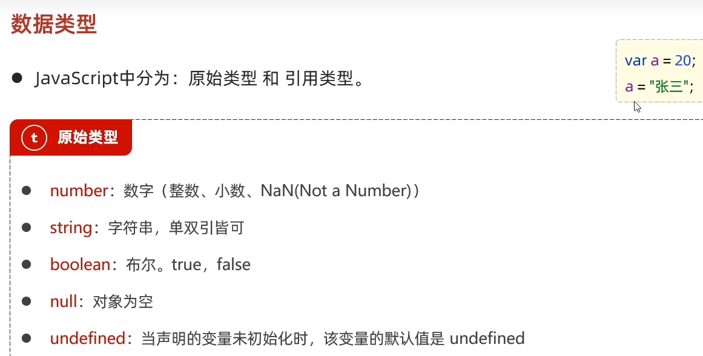
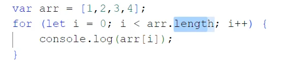
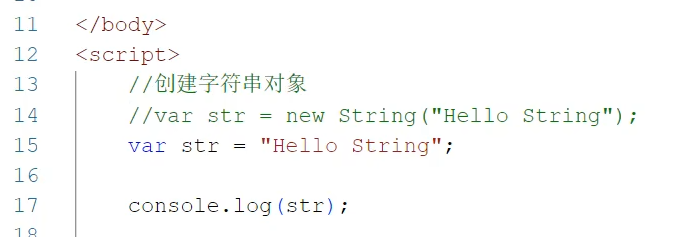
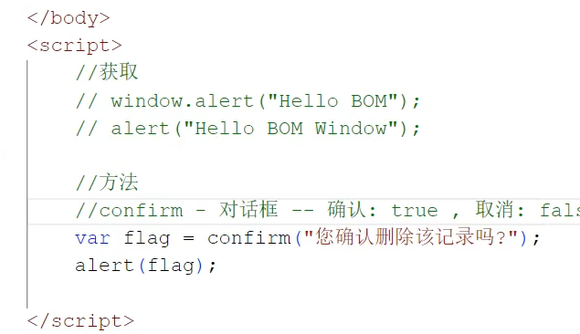
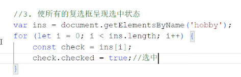
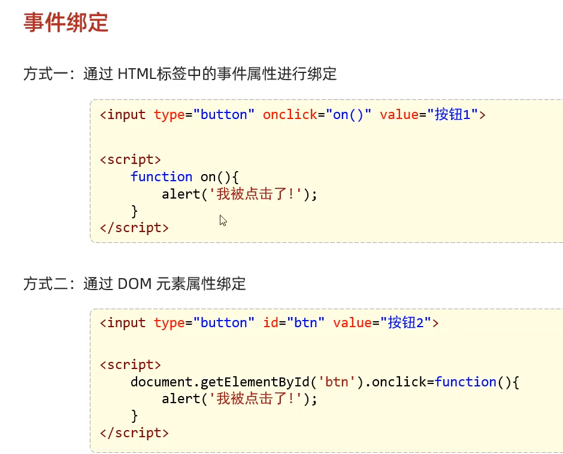

# Java Web 黑马

web开发 的常规工作流

**重点关注**: 服务器端和数据库

## agenda
共20天左右

注意这里的part6 两种部署方式

了解详细的项目开发流程, 严格前后段分离

HTML: 网页的元素
CSS: 布局
JS: 动作和行为

# Part 1 前段开发 HTML(结构) + CSS(样式)

查找 前端三剑客 标签列表和用途:

img 需要的属性是 文件目录.

_HTML标签不区分大小写!_

## JS 

### JS 的引入方式

JS 标签不能自闭合, 必须使用 开头和结尾 tag

**输出语句**:

原来 JS  也是动态类型语言!

--> 然后使用前面的输出方法, 将变量输出!

全局变量表示, 我们可以从大括号外面取到该变量

下面的赋值会覆盖上一个

### 类型转换

### 流程控制

### JS  函数

### JS 对象

- 3 个基础对象: Array, String, JSON
- 浏览器对象: BOM, (封装了浏览器对象)
- DOM - HTML 标签被封装成了对象

  

#### Array

Array类似JAVA 的集合 : 长度可变, 类型可变

foreach 循环只遍历有值的元素, 普通for循环便利所有元素

==> 箭头函数类似 java 的lambda表达式

删除元素: (从第几个索引位置开始, 删除几个元素)

#### String

string的属性和方法

### JS 自定义对象

自定义对象包含方法, 注意两种定义方法的方式:

### JSON

key必须使用双引号!

前后段交互使用json, 请求复杂数据

### BOM

设定定时器:

截止时间, 仅执行一次

获取当前地址, 然后重新定向到新地址: 

### DOM
**使用DOM 操作, 修改原始HTML 文档的内容和格式**

--> HTML DOM 是核心DOM 的子集, 将所有HTML标签封装成了对象

4种获取元素的方法实现:

#### DOM 案例

1. 点亮灯泡
实际上是通过id替换图片

2. 修改html标签

灵活利用标签对象的属性

3. 勾选 复选框

### JS 事件监听

还是html牛逼阿, table的起始标签居然这么长!!:

#### JS 事件监听案例

原始页面:

## Vue - 一个高级前端框架

双向数据绑定, 类似 MVC 设计模式, 当模型和视图中的一个发生改变, 则另一个同步发生改变.

双向绑定不需要手动实现, 而是依靠框架

